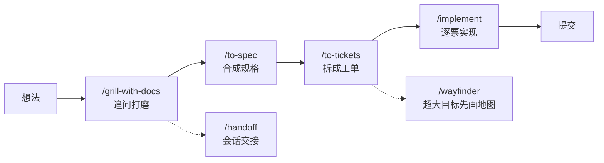

<div align="center">

# dsh-mattpocock-skills

**Matt Pocock 的 25 个工程与生产力技能，为 DeepSeek Harness 定制**

一条命令安装，模型自动调用，或用 `/命令` 手动触发


</div>

---

## 📦 安装

```bash
dsh plugin --profile web add github:engty/dsh-mattpocock-skills
```

> `web` 换成你实际使用的 profile 名即可。

安装后**新开一个会话**即生效（skill catalog 自动刷新，无需重启）。卸载：

```bash
dsh plugin --profile web remove dsh-mattpocock-skills
```

已验证：安装约 4.5 秒，自动挂载为最低优先级的 bundled 技能源，**不会遮蔽**你自己写的或项目里的同名技能。

---

## 🚀 快速上手

**① 把一个想法打磨成能动手的方案**

```
/grill-with-docs 给交易记录加一个导出 CSV 的功能
```

它会反复追问你（带推荐答案），把边界、失败分支、命名都问清楚，同时把术语写进 `CONTEXT.md`、把关键决策记成 ADR。

**② 从想法一路做到提交**

```
/to-spec          # 把上面的讨论直接合成规格，不问问题
/to-tickets       # 拆成有依赖关系的工单
/implement        # 逐票实现：内部走 TDD，收尾跑双轴代码审查
```

**③ 修一个难缠的 bug**

> 直接说「这个对账偶尔丢单，帮我 debug 一下」

`diagnosing-bugs` 会自动接管：先逼出一个能在**这个 bug 上变红**的复现命令，再最小化、列假设、埋点、修复、补回归测试——不拿到反馈环不许猜原因。

**④ 长会话要交接**

```
/handoff 明天接着做推送重试
```

写出交接文档，并把关键状态写进 dsh 记忆，下一个会话直接接手。

---

## ⌨️ 命令一览

以下命令在输入框直接输入（`/` 后跟名字），可以附加一句说明。

### 起步与配置

| 命令 | 作用 |
|---|---|
| `/ask` | 不知道该用哪个技能时问它——它是整个技能包的路由器 |
| `/setup-matt-pocock-skills` | 每个仓库跑一次：配置工单系统、分诊标签、文档目录 |

### 对齐与规划

| 命令 | 作用 |
|---|---|
| `/grill-me` | 追问式访谈，把方案打磨到没有含糊之处（不留文档） |
| `/grill-with-docs` | 同上，但顺手把术语和决策落成 `CONTEXT.md` 与 ADR |
| `/to-spec` | 把当前对话直接合成一份规格并发布到工单系统（不追问） |
| `/to-tickets` | 把计划/规格拆成「曳光弹」工单，带阻塞关系，可逐票实现 |
| `/wayfinder` | 面对大到一次会话装不下的模糊目标：先画一张共享决策地图，逐张啃 |

### 实现与审查

| 命令 | 作用 |
|---|---|
| `/implement` | 按规格或工单实现：内部走 TDD，收尾跑双轴代码审查，然后提交 |
| `/improve-codebase-architecture` | 代码库架构体检：找出「深化」机会，出交互式报告，挑一个深挖 |
| `/resolving-merge-conflicts` | 逐个 hunk 按**意图**解决合并/变基冲突，永不 `--abort` |

### 协作与交付

| 命令 | 作用 |
|---|---|
| `/triage` | 把 issue 和外部 PR 推过一套分诊状态机，产出 agent 可直接执行的简报 |
| `/to-questionnaire` | 把「只有别人能回答」的决策变成一份问卷，交给对方填 |
| `/teach` | 用当前目录当教学工作区，跨多次会话教你一个主题 |
| `/handoff` | 把当前会话压成交接文档 + 记忆，交给下一个会话或子代理 |
| `/wait-what` | 上一句话没听懂时敲它：用最短的中文重讲一遍 |

---

## 🤖 自动生效的技能

以下 11 个不用手动调用——在合适的场景下模型会自己加载。你也可以在对话里直接描述需求来触发它们：

| 技能 | 什么时候会自动启用 |
|---|---|
| `tdd` | 「用测试先行实现」「红绿重构」 |
| `diagnosing-bugs` | 「诊断 / 调试 / 这里坏了 / 变慢了」 |
| `code-review` | 「review 一下自 main 以来的改动」 |
| `research` | 「帮我调研一下」「查一下官方文档怎么说」 |
| `prototype` | 「先做个原型试试」「这个状态机这样设计对不对」 |
| `grilling` | 「拷问一下我的想法」 |
| `domain-modeling` | 「统一一下术语」「写个 ADR」 |
| `codebase-design` | 「这个模块的接口该怎么设计」 |
| `resolving-merge-conflicts` | 「解决冲突」「合并冲突」 |
| `wizard` | 「带我一步步配好」「需要我手动点的地方列出来」 |
| `writing-for-agents` | 「写个 skill」「改一下 AGENTS.md」 |

---

## 🧭 推荐流水线



工单驱动实现时，每张票开一个新会话，上下文互不污染。

---

## 📋 环境要求

- **DeepSeek Harness** `0.1.5-rc.2` 或更新版本
- 无需额外依赖：插件复用 dsh 第一方的技能加载器，纯技能包

<details>
<summary>技术细节</summary>

- `lib/index.js`：薄 cordis 插件，用 `@deepseek-ai/dsh-skill-filesystem` 的 `FileSystemSkillProvider` 注册一个 bundled 技能源（`includeDefaultRoots: false`，rank 600）。
- `cordis.patch.yml`：声明 `dsh.bundle.patch`，`dsh plugin add` 会据此自动把它挂进 profile 的插件层。
- `skills/`：25 个技能的完整目录（`SKILL.md` + 辅助文件），每个都带 kebab-case `name`、`description` 与中文触发词。

</details>

---

## 📄 许可证

MIT。本技能包改版自 **[mattpocock/skills](https://github.com/mattpocock/skills)**（© Matt Pocock，MIT 许可）。
